# 🚆 Railway Reservation System — OOAD Project

<div align="center">


**A complete Object-Oriented Analysis & Design model of an online Railway Reservation System.**

</div>

---

## 📖 About

This repository contains the full OOAD / UML design of a **Railway Reservation System** — from
use-case analysis down to the deployment topology — modelled in
[StarUML](https://staruml.io) (`.mdj` files).

The design covers **five core passenger-facing flows**:

| # | Flow | What it models |
|:-:|------|----------------|
| 1 | 👤 **User Registration** | Account creation with Aadhaar / email / mobile (OTP) verification and credential setup |
| 2 | 🔍 **Train Enquiry** | Schedule lookup, direct & connected routes, seat availability, fare & quota details |
| 3 | 🎫 **Ticket Booking** | Train & class selection, berth preference, seat hold, PNR generation, e-ticket |
| 4 | 💳 **Payment & Billing** | Gateway authorization (Razorpay / Stripe / Paytm), e-ticket & invoice generation |
| 5 | ❌ **Ticket Cancellation** | Cancellation rules, partial cancellation, refund calculation & processing |

> **28 StarUML models** · 12 UML diagram types · every diagram documented below with a rendered preview.

## 📂 Repository Structure

```text
Railway Reservation System _OOAD_Project/
├── README.md                        ← you are here
├── LICENSE
├── .gitignore
└── diagrams/
    ├── use-case/                    # 5 — actors & system responsibilities per flow
    ├── domain-model/                # 1 — conceptual domain classes (project-wide)
    ├── class-diagram/               # 1 — design-level classes, attributes & operations
    ├── sequence/
    │   ├── high-level/              # 5 — object interaction per flow
    │   ├── system/                  # 5 — black-box system events per flow
    │   └── detailed/                # 2 — end-to-end booking & cancellation/refund
    ├── activity/                    # 2 — booking & payment workflows
    ├── state-machine/               # 2 — booking & payment object lifecycles
    ├── communication/               # 2 — object collaborations per flow
    ├── component/                   # 1 — software components & services
    ├── deployment/                  # 1 — physical network topology
    └── package/                     # 1 — layered architectural packages
```

## 🗂 Diagram Catalog

### Analysis view

| Diagram | File | Description |
|---------|------|-------------|
| Use case — User Registration | [`diagrams/use-case/user-registration.mdj`](diagrams/use-case/user-registration.mdj) | Terms acceptance, Aadhaar proof, OTP & e-mail verification, account creation |
| Use case — Ticket Booking | [`diagrams/use-case/ticket-booking.mdj`](diagrams/use-case/ticket-booking.mdj) | Journey details, train & class selection, berth availability, payment authorization |
| Use case — Ticket Cancellation | [`diagrams/use-case/ticket-cancellation.mdj`](diagrams/use-case/ticket-cancellation.mdj) | Ticket validity, cancellation rules & charges, refund processing |
| Use case — Payment & Billing | [`diagrams/use-case/payment-billing.mdj`](diagrams/use-case/payment-billing.mdj) | Payment modes, gateway authorization, e-ticket & invoice generation, history |
| Use case — Train Enquiry | [`diagrams/use-case/train-enquiry.mdj`](diagrams/use-case/train-enquiry.mdj) | Schedules, routes, seat availability, fare & quota, station amenities |
| Domain model | [`diagrams/domain-model/domain-model.mdj`](diagrams/domain-model/domain-model.mdj) | 10 conceptual classes: `UserAccount`, `Passenger`, `Ticket`, `Payment`, `Train`, `Schedule`, `SeatInventory`, `TravelerDetails`, `PaymentGateway`, `Refund` |

### Design view

| Diagram | File | Description |
|---------|------|-------------|
| Design class diagram | [`diagrams/class-diagram/design-class-diagram.mdj`](diagrams/class-diagram/design-class-diagram.mdj) | Attributes, operations & multiplicities for all 10 domain classes |
| Sequence — User Registration | [`diagrams/sequence/high-level/user-registration-flow.mdj`](diagrams/sequence/high-level/user-registration-flow.mdj) | `User → RegistrationForm → RegistrationController → PassengerDAO` |
| Sequence — Ticket Booking | [`diagrams/sequence/high-level/ticket-booking-flow.mdj`](diagrams/sequence/high-level/ticket-booking-flow.mdj) | Search criteria → availability → booking request → seat verification |
| Sequence — Train Enquiry | [`diagrams/sequence/high-level/train-enquiry-flow.mdj`](diagrams/sequence/high-level/train-enquiry-flow.mdj) | Direct & connected route lookup with detailed schedules |
| Sequence — Payment | [`diagrams/sequence/high-level/payment-flow.mdj`](diagrams/sequence/high-level/payment-flow.mdj) | Billing initiation → gateway transaction → e-ticket display |
| Sequence — Cancellation | [`diagrams/sequence/high-level/ticket-cancellation-flow.mdj`](diagrams/sequence/high-level/ticket-cancellation-flow.mdj) | PNR-based cancellation with refund details |
| System sequence — Cancellation | [`diagrams/sequence/system/ticket-cancellation.mdj`](diagrams/sequence/system/ticket-cancellation.mdj) | Black-box events between `Passenger` and the cancellation system |
| System sequence — Payment | [`diagrams/sequence/system/payment.mdj`](diagrams/sequence/system/payment.mdj) | Black-box events between `Passenger` and the payment system |
| System sequence — Train Enquiry | [`diagrams/sequence/system/train-enquiry.mdj`](diagrams/sequence/system/train-enquiry.mdj) | Black-box events between `Passenger` and the enquiry system |
| System sequence — Registration (v1) | [`diagrams/sequence/system/user-registration-v1.mdj`](diagrams/sequence/system/user-registration-v1.mdj) | First iteration of the registration system events |
| System sequence — Registration (v2) | [`diagrams/sequence/system/user-registration-v2.mdj`](diagrams/sequence/system/user-registration-v2.mdj) | Refined registration system events |
| Detailed sequence — Ticket Booking | [`diagrams/sequence/detailed/ticket-booking.mdj`](diagrams/sequence/detailed/ticket-booking.mdj) | `BookingScreen → BookingController → Train/Payment/Ticket`, 32 messages |
| Detailed sequence — Cancellation & Refund | [`diagrams/sequence/detailed/ticket-cancellation-refund.mdj`](diagrams/sequence/detailed/ticket-cancellation-refund.mdj) | Involves `RefundService`, `PaymentGateway` & `NotificationService` |
| Activity — Ticket Booking | [`diagrams/activity/ticket-booking-flow.mdj`](diagrams/activity/ticket-booking-flow.mdj) | From search criteria to e-ticket, incl. waitlist/regret branch |
| Activity — Payment | [`diagrams/activity/payment-flow.mdj`](diagrams/activity/payment-flow.mdj) | Pending transaction → gateway redirect → e-ticket & confirmation |
| State machine — Ticket Booking | [`diagrams/state-machine/ticket-booking.mdj`](diagrams/state-machine/ticket-booking.mdj) | `Initiated → Awaiting Payment → Confirmed/Waitlisted/Failed → Cancelled` |
| State machine — Payment | [`diagrams/state-machine/payment.mdj`](diagrams/state-machine/payment.mdj) | `Initiated → Awaiting Authorization → Processing → Success/Failed → Refunded` |
| Communication — Ticket Booking | [`diagrams/communication/ticket-booking-flow.mdj`](diagrams/communication/ticket-booking-flow.mdj) | 9 collaborating objects, 21 messages |
| Communication — User Registration | [`diagrams/communication/user-registration-flow.mdj`](diagrams/communication/user-registration-flow.mdj) | Registration collaboration incl. security & profile-rules objects |

### Architecture view

| Diagram | File | Description |
|---------|------|-------------|
| Component diagram | [`diagrams/component/component-diagram.mdj`](diagrams/component/component-diagram.mdj) | Portal, Booking/Train/Payment/Ticket services, DB, gateways (Razorpay/Stripe/Paytm) |
| Deployment diagram | [`diagrams/deployment/deployment-diagram.mdj`](diagrams/deployment/deployment-diagram.mdj) | Passenger device → web/app server → DB, payment & notification servers |
| Package diagram | [`diagrams/package/package-diagram.mdj`](diagrams/package/package-diagram.mdj) | 9 packages: passenger, booking, train, baggage, payment, operations, security… |

## 📊 Diagram Previews

> These previews are auto-generated from the models for quick reading.
> Open the `.mdj` files in StarUML for the authoritative, fully-formatted diagrams.

### 🏛 Design Class Diagram

Source: [`diagrams/class-diagram/design-class-diagram.mdj`](diagrams/class-diagram/design-class-diagram.mdj)

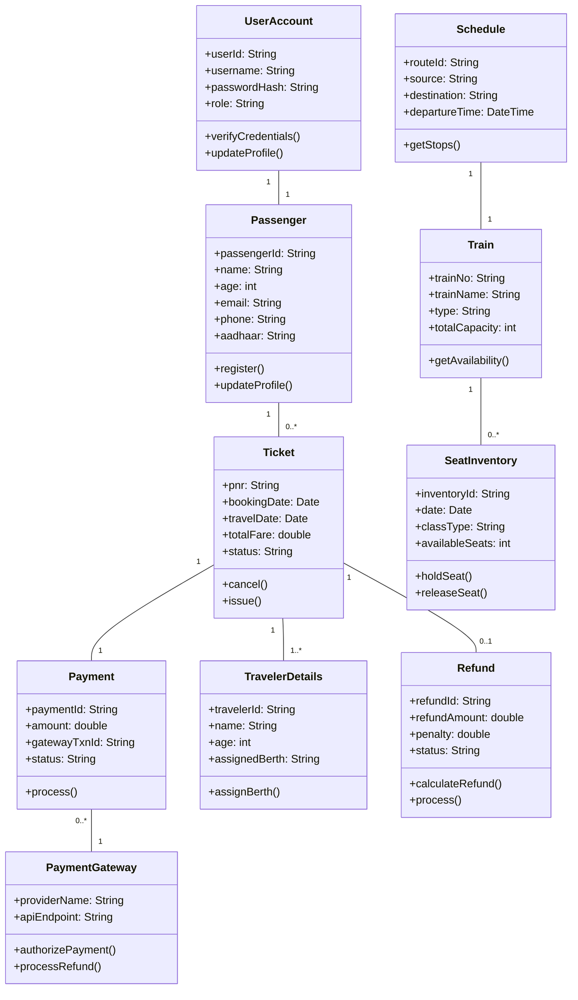
```mermaid
classDiagram
  class UserAccount {
    +userId: String
    +username: String
    +passwordHash: String
    +role: String
    +verifyCredentials()
    +updateProfile()
  }
  class Passenger {
    +passengerId: String
    +name: String
    +age: int
    +email: String
    +phone: String
    +aadhaar: String
    +register()
    +updateProfile()
  }
  class Ticket {
    +pnr: String
    +bookingDate: Date
    +travelDate: Date
    +totalFare: double
    +status: String
    +cancel()
    +issue()
  }
  class Payment {
    +paymentId: String
    +amount: double
    +gatewayTxnId: String
    +status: String
    +process()
  }
  class PaymentGateway {
    +providerName: String
    +apiEndpoint: String
    +authorizePayment()
    +processRefund()
  }
  class TravelerDetails {
    +travelerId: String
    +name: String
    +age: int
    +assignedBerth: String
    +assignBerth()
  }
  class Schedule {
    +routeId: String
    +source: String
    +destination: String
    +departureTime: DateTime
    +getStops()
  }
  class Train {
    +trainNo: String
    +trainName: String
    +type: String
    +totalCapacity: int
    +getAvailability()
  }
  class SeatInventory {
    +inventoryId: String
    +date: Date
    +classType: String
    +availableSeats: int
    +holdSeat()
    +releaseSeat()
  }
  class Refund {
    +refundId: String
    +refundAmount: double
    +penalty: double
    +status: String
    +calculateRefund()
    +process()
  }
  UserAccount "1" -- "1" Passenger
  Passenger "1" -- "0..*" Ticket
  Ticket "1" -- "1" Payment
  Ticket "1" -- "1..*" TravelerDetails
  Ticket "1" -- "0..1" Refund
  Payment "0..*" -- "1" PaymentGateway
  Schedule "1" -- "1" Train
  Train "1" -- "0..*" SeatInventory
```

<details>
<summary><b>🌱 Domain Model (click to expand)</b> — <code>diagrams/domain-model/domain-model.mdj</code></summary>

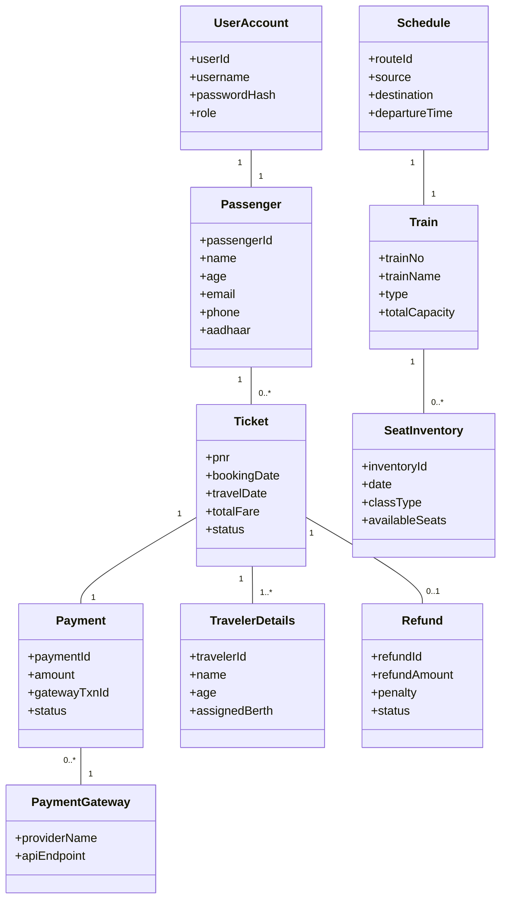
```mermaid
classDiagram
  class UserAccount {
    +userId
    +username
    +passwordHash
    +role
  }
  class Passenger {
    +passengerId
    +name
    +age
    +email
    +phone
    +aadhaar
  }
  class Ticket {
    +pnr
    +bookingDate
    +travelDate
    +totalFare
    +status
  }
  class Payment {
    +paymentId
    +amount
    +gatewayTxnId
    +status
  }
  class PaymentGateway {
    +providerName
    +apiEndpoint
  }
  class TravelerDetails {
    +travelerId
    +name
    +age
    +assignedBerth
  }
  class Schedule {
    +routeId
    +source
    +destination
    +departureTime
  }
  class Train {
    +trainNo
    +trainName
    +type
    +totalCapacity
  }
  class SeatInventory {
    +inventoryId
    +date
    +classType
    +availableSeats
  }
  class Refund {
    +refundId
    +refundAmount
    +penalty
    +status
  }
  UserAccount "1" -- "1" Passenger
  Passenger "1" -- "0..*" Ticket
  Ticket "1" -- "1" Payment
  Ticket "1" -- "1..*" TravelerDetails
  Ticket "1" -- "0..1" Refund
  Payment "0..*" -- "1" PaymentGateway
  Schedule "1" -- "1" Train
  Train "1" -- "0..*" SeatInventory
```

</details>

### 👥 Use Case Diagrams

<details open>
<summary><b>👤 User Registration</b> — <code>diagrams/use-case/user-registration.mdj</code></summary>

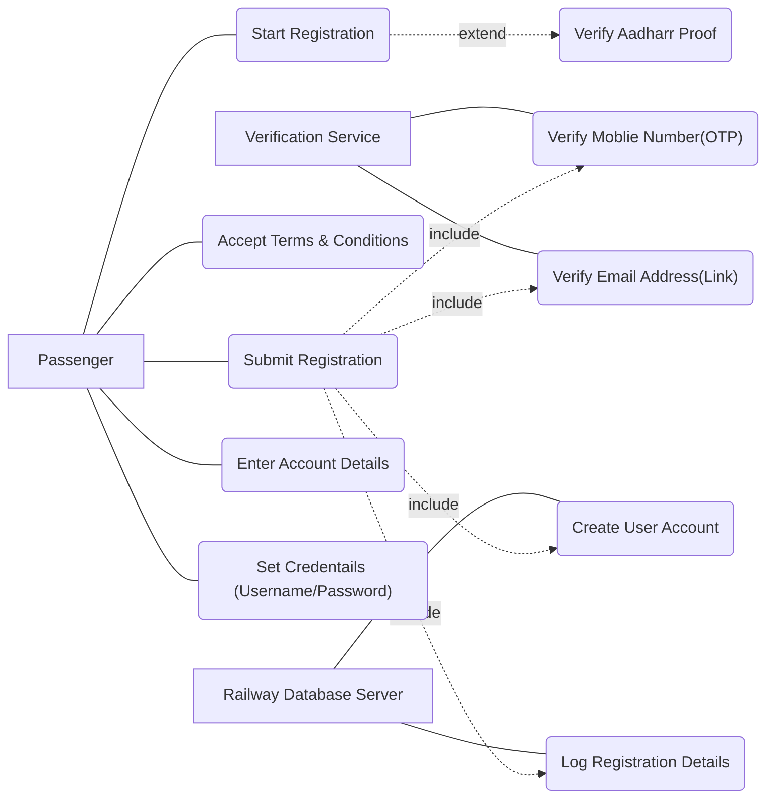
```mermaid
flowchart LR
  A1["Passenger"]
  A2["Verification Service"]
  A3["Railway Database Server"]
  UC1("Accept Terms & Conditions")
  UC2("Verify Aadharr Proof")
  UC3("Create User Account")
  UC4("Verify Moblie Number(OTP)")
  UC5("Start Registration")
  UC6("Enter Account Details")
  UC7("Set Credentails (Username/Password)")
  UC8("Submit Registration")
  UC9("Verify Email Address(Link)")
  UC10("Log Registration Details")
  A1 --- UC5
  A1 --- UC6
  A1 --- UC7
  A1 --- UC1
  A1 --- UC8
  A2 --- UC4
  A2 --- UC9
  A3 --- UC3
  A3 --- UC10
  UC8 -. include .-> UC4
  UC8 -. include .-> UC9
  UC8 -. include .-> UC3
  UC8 -. include .-> UC10
  UC5 -. extend .-> UC2
```

</details>

<details>
<summary><b>🎫 Ticket Booking</b> — <code>diagrams/use-case/ticket-booking.mdj</code></summary>

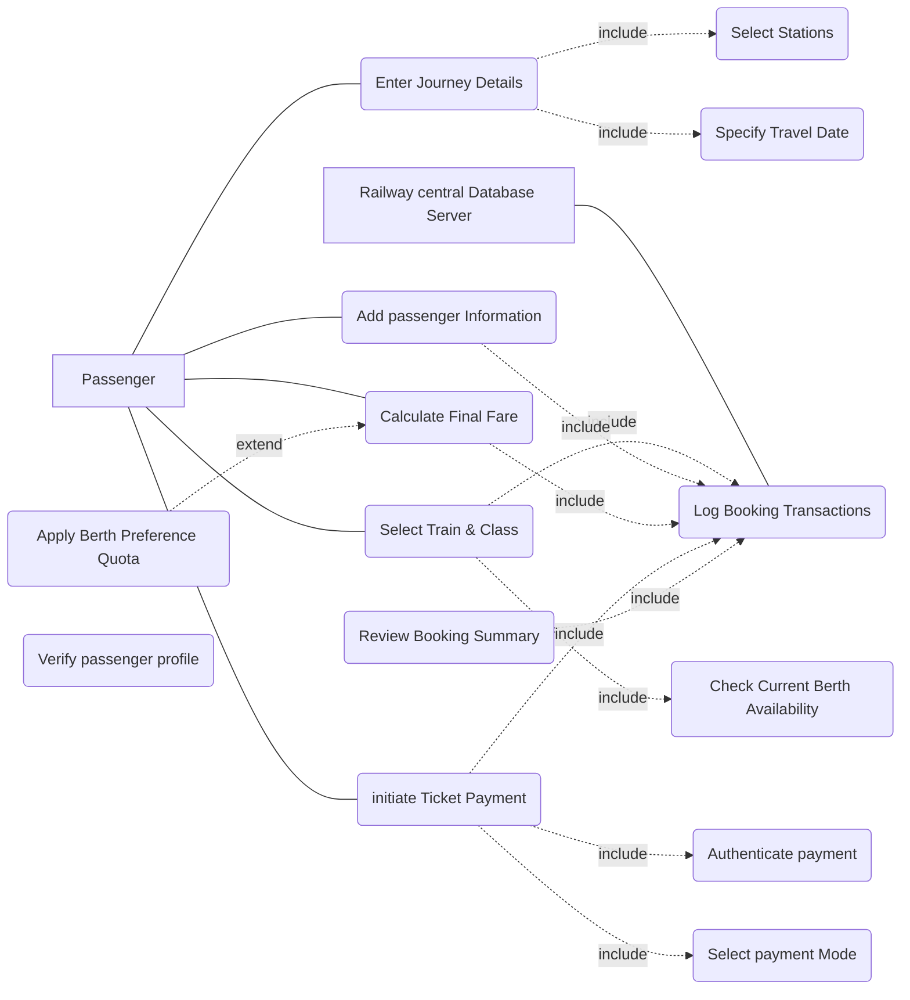
```mermaid
flowchart LR
  A1["Passenger"]
  A2["Railway central Database Server"]
  UC1("Enter Journey Details")
  UC2("Select Train & Class")
  UC3("Add passenger Information")
  UC4("Calculate Final Fare")
  UC5("Apply Berth Preference Quota")
  UC6("Specify Travel Date")
  UC7("Verify passenger profile")
  UC8("Authenticate payment")
  UC9("Select payment Mode")
  UC10("initiate Ticket Payment")
  UC11("Review Booking Summary")
  UC12("Select Stations")
  UC13("Check Current Berth Availability")
  UC14("Log Booking Transactions")
  A1 --- UC1
  A1 --- UC2
  A1 --- UC3
  A1 --- UC4
  A1 --- UC10
  A2 --- UC14
  UC1 -. include .-> UC12
  UC1 -. include .-> UC6
  UC2 -. include .-> UC14
  UC2 -. include .-> UC13
  UC3 -. include .-> UC14
  UC4 -. include .-> UC14
  UC10 -. include .-> UC8
  UC10 -. include .-> UC9
  UC10 -. include .-> UC14
  UC11 -. include .-> UC14
  UC5 -. extend .-> UC4
```

</details>

<details>
<summary><b>🔍 Train Enquiry</b> — <code>diagrams/use-case/train-enquiry.mdj</code></summary>

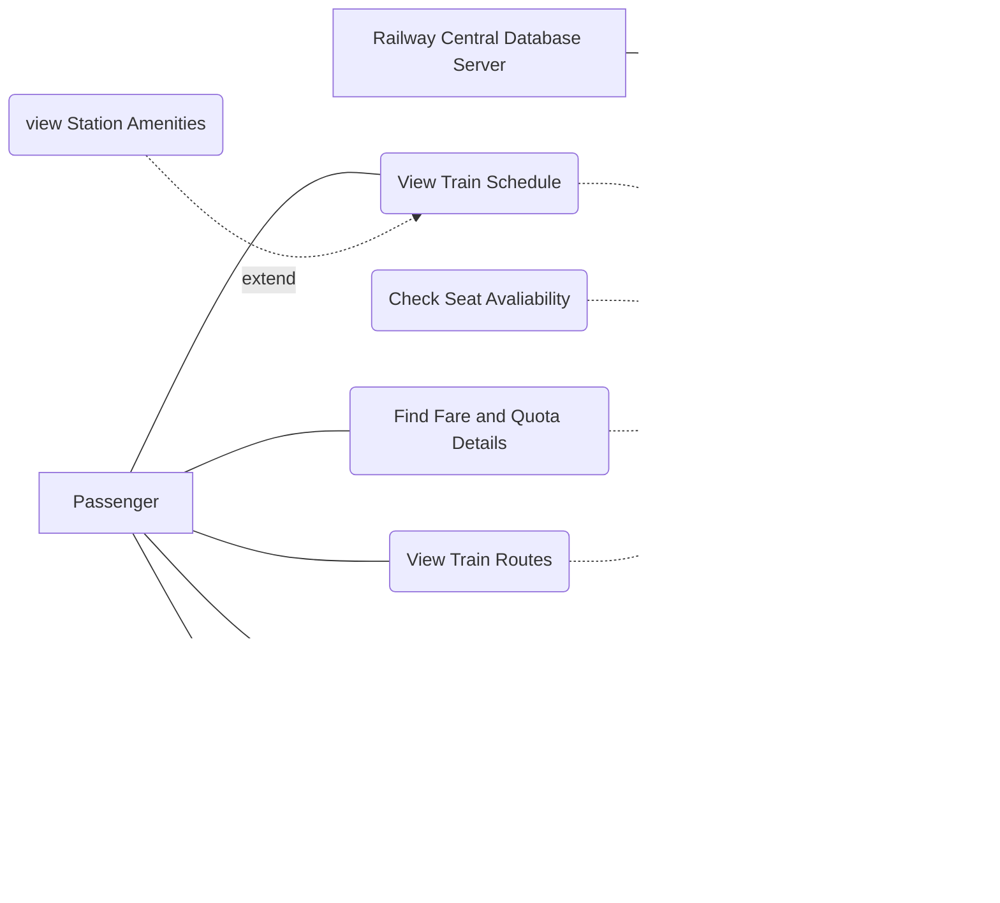
```mermaid
flowchart LR
  A1["Passenger"]
  A2["Railway Central Database Server"]
  UC1("View Train Schedule")
  UC2("view Station Amenities")
  UC3("Check Seat Avaliability")
  UC4("Find Fare and Quota Details")
  UC5("View Train Routes")
  UC6("Log Enquiry Transactions")
  UC7("Specify Travel Date")
  UC8("Access Enquiry Portal")
  UC9("Enter Search Criteria")
  UC10("Select Origin / Destination")
  A1 --- UC8
  A1 --- UC9
  A1 --- UC1
  A1 --- UC4
  A1 --- UC5
  A2 --- UC6
  UC1 -. include .-> UC6
  UC3 -. include .-> UC6
  UC4 -. include .-> UC6
  UC5 -. include .-> UC6
  UC9 -. include .-> UC10
  UC9 -. include .-> UC7
  UC9 -. include .-> UC6
  UC2 -. extend .-> UC1
```

</details>

<details>
<summary><b>💳 Payment & Billing</b> — <code>diagrams/use-case/payment-billing.mdj</code></summary>

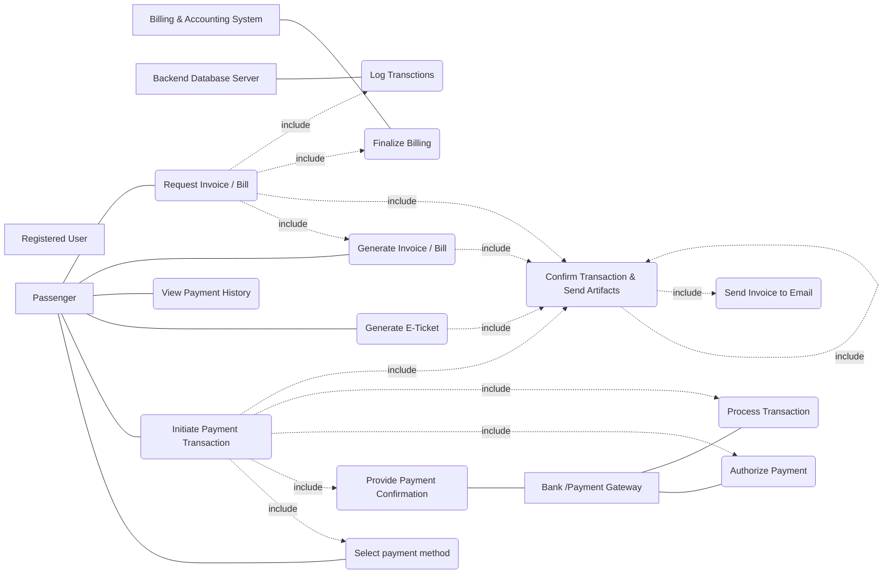
```mermaid
flowchart LR
  A1["Registered User"]
  A2["Passenger"]
  A3["Bank /Payment Gateway"]
  A4["Billing & Accounting System"]
  A5["Backend Database Server"]
  UC1("Confirm Transaction & Send Artifacts")
  UC2("Send Invoice to Email")
  UC3("Finalize Billing")
  UC4("Log Transctions")
  UC5("Initiate Payment Transaction")
  UC6("Generate E-Ticket")
  UC7("View Payment History")
  UC8("Select payment method")
  UC9("Generate Invoice / Bill")
  UC10("Request Invoice / Bill")
  UC11("Provide Payment Confirmation")
  UC12("Authorize Payment")
  UC13("Process Transaction")
  UC11 --- A3
  A2 --- UC8
  A2 --- UC5
  A2 --- UC6
  A2 --- UC7
  A2 --- UC9
  A2 --- UC10
  A3 --- UC12
  A3 --- UC13
  A4 --- UC3
  A5 --- UC4
  UC1 -. include .-> UC1
  UC1 -. include .-> UC2
  UC5 -. include .-> UC8
  UC5 -. include .-> UC11
  UC5 -. include .-> UC12
  UC5 -. include .-> UC13
  UC5 -. include .-> UC1
  UC6 -. include .-> UC1
  UC9 -. include .-> UC1
  UC10 -. include .-> UC9
  UC10 -. include .-> UC1
  UC10 -. include .-> UC3
  UC10 -. include .-> UC4
```

</details>

<details>
<summary><b>❌ Ticket Cancellation</b> — <code>diagrams/use-case/ticket-cancellation.mdj</code></summary>

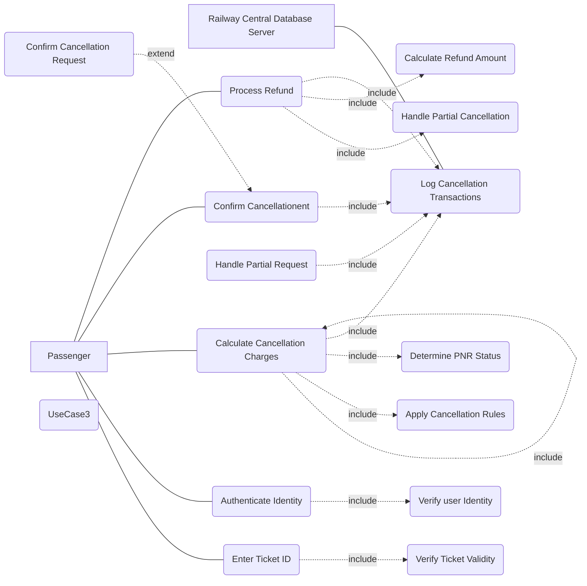
```mermaid
flowchart LR
  A1["Passenger"]
  A2["Railway Central Database Server"]
  UC1("Calculate Cancellation Charges")
  UC2("Confirm Cancellationent")
  UC3("Confirm Cancellation Request")
  UC4("Handle Partial Request")
  UC5("Process Refund")
  UC6("Verify Ticket Validity")
  UC7("Determine PNR Status")
  UC8("Verify user Identity")
  UC9("Apply Cancellation Rules")
  UC10("Log Cancellation Transactions")
  UC11("UseCase3")
  UC12("Handle Partial Cancellation")
  UC13("Calculate Refund Amount")
  UC14("Enter Ticket ID")
  UC15("Authenticate Identity")
  A1 --- UC14
  A1 --- UC15
  A1 --- UC1
  A1 --- UC2
  A1 --- UC5
  A2 --- UC10
  UC1 -. include .-> UC1
  UC1 -. include .-> UC9
  UC1 -. include .-> UC7
  UC1 -. include .-> UC10
  UC2 -. include .-> UC10
  UC4 -. include .-> UC10
  UC5 -. include .-> UC12
  UC5 -. include .-> UC13
  UC5 -. include .-> UC10
  UC14 -. include .-> UC6
  UC15 -. include .-> UC8
  UC3 -. extend .-> UC2
```

</details>

### 🔁 High-Level Sequence Diagrams

<details>
<summary><b>👤 User Registration Flow</b> — <code>diagrams/sequence/high-level/user-registration-flow.mdj</code></summary>

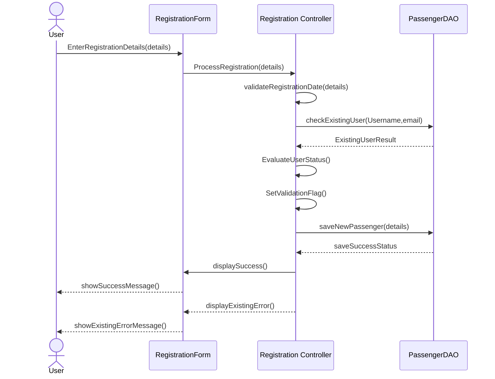
```mermaid
sequenceDiagram
  actor P1 as User
  participant P2 as RegistrationForm
  participant P3 as Registration Controller
  participant P4 as PassengerDAO
  P1->>P2: EnterRegistrationDetails(details)
  P2->>P3: ProcessRegistration(details)
  P3->>P3: validateRegistrationDate(details)
  P3->>P4: checkExistingUser(Username,email)
  P4-->>P3: ExistingUserResult
  P3->>P3: EvaluateUserStatus()
  P3->>P3: SetValidationFlag()
  P3->>P4: saveNewPassenger(details)
  P4-->>P3: saveSuccessStatus
  P3->>P2: displaySuccess()
  P2-->>P1: showSuccessMessage()
  P3-->>P2: displayExistingError()
  P2-->>P1: showExistingErrorMessage()
```

</details>

<details>
<summary><b>🎫 Ticket Booking Flow</b> — <code>diagrams/sequence/high-level/ticket-booking-flow.mdj</code></summary>

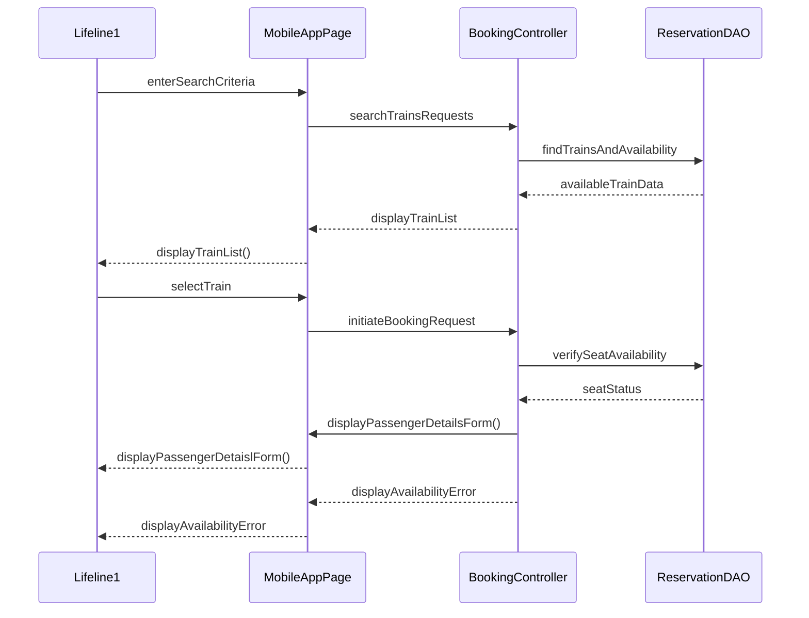
```mermaid
sequenceDiagram
  participant P1 as Lifeline1
  participant P2 as MobileAppPage
  participant P3 as BookingController
  participant P4 as ReservationDAO
  P1->>P2: enterSearchCriteria
  P2->>P3: searchTrainsRequests
  P3->>P4: findTrainsAndAvailability
  P4-->>P3: availableTrainData
  P3-->>P2: displayTrainList
  P2-->>P1: displayTrainList()
  P1->>P2: selectTrain
  P2->>P3: initiateBookingRequest
  P3->>P4: verifySeatAvailability
  P4-->>P3: seatStatus
  P3->>P2: displayPassengerDetailsForm()
  P2-->>P1: displayPassengerDetaislForm()
  P3-->>P2: displayAvailabilityError
  P2-->>P1: displayAvailabilityError
```

</details>

<details>
<summary><b>🔍 Train Enquiry Flow</b> — <code>diagrams/sequence/high-level/train-enquiry-flow.mdj</code></summary>

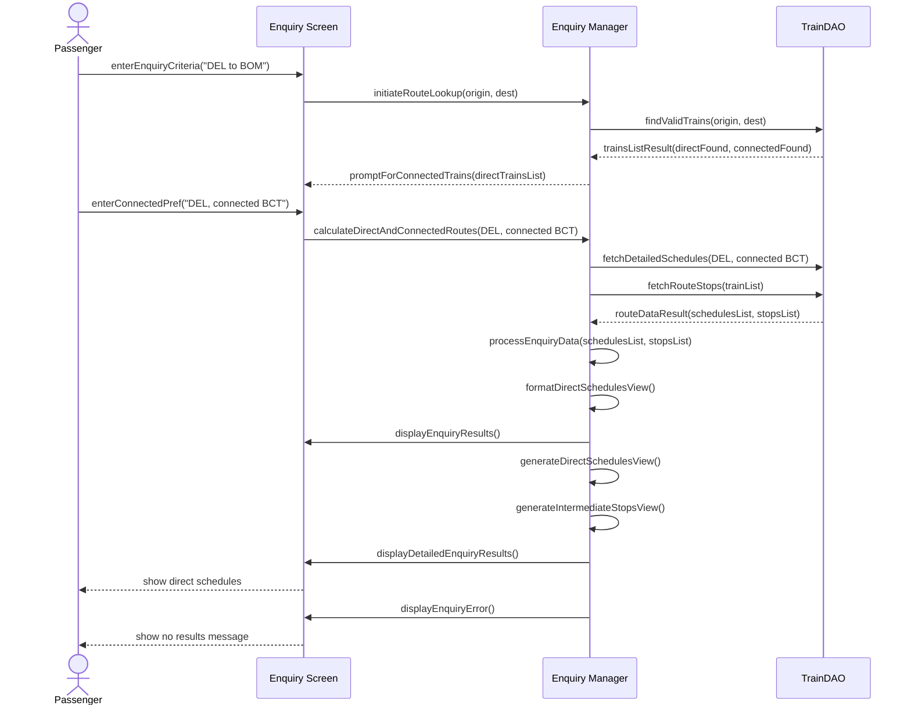
```mermaid
sequenceDiagram
  actor P1 as Passenger
  participant P2 as Enquiry Screen
  participant P3 as Enquiry Manager
  participant P4 as TrainDAO
  P1->>P2: enterEnquiryCriteria("DEL to BOM")
  P2->>P3: initiateRouteLookup(origin, dest)
  P3->>P4: findValidTrains(origin, dest)
  P4-->>P3: trainsListResult(directFound, connectedFound)
  P3-->>P2: promptForConnectedTrains(directTrainsList)
  P1->>P2: enterConnectedPref("DEL, connected BCT")
  P2->>P3: calculateDirectAndConnectedRoutes(DEL, connected BCT)
  P3->>P4: fetchDetailedSchedules(DEL, connected BCT)
  P3->>P4: fetchRouteStops(trainList)
  P4-->>P3: routeDataResult(schedulesList, stopsList)
  P3->>P3: processEnquiryData(schedulesList, stopsList)
  P3->>P3: formatDirectSchedulesView()
  P3->>P2: displayEnquiryResults()
  P3->>P3: generateDirectSchedulesView()
  P3->>P3: generateIntermediateStopsView()
  P3->>P2: displayDetailedEnquiryResults()
  P2-->>P1: show direct schedules
  P3->>P2: displayEnquiryError()
  P2-->>P1: show no results message
```

</details>

<details>
<summary><b>💳 Payment Flow</b> — <code>diagrams/sequence/high-level/payment-flow.mdj</code></summary>

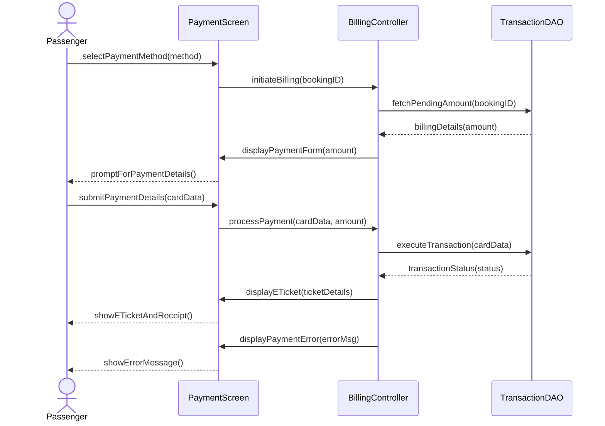
```mermaid
sequenceDiagram
  actor P1 as Passenger
  participant P2 as PaymentScreen
  participant P3 as BillingController
  participant P4 as TransactionDAO
  P1->>P2: selectPaymentMethod(method)
  P2->>P3: initiateBilling(bookingID)
  P3->>P4: fetchPendingAmount(bookingID)
  P4-->>P3: billingDetails(amount)
  P3->>P2: displayPaymentForm(amount)
  P2-->>P1: promptForPaymentDetails()
  P1->>P2: submitPaymentDetails(cardData)
  P2->>P3: processPayment(cardData, amount)
  P3->>P4: executeTransaction(cardData)
  P4-->>P3: transactionStatus(status)
  P3->>P2: displayETicket(ticketDetails)
  P2-->>P1: showETicketAndReceipt()
  P3->>P2: displayPaymentError(errorMsg)
  P2-->>P1: showErrorMessage()
```

</details>

<details>
<summary><b>❌ Ticket Cancellation Flow</b> — <code>diagrams/sequence/high-level/ticket-cancellation-flow.mdj</code></summary>

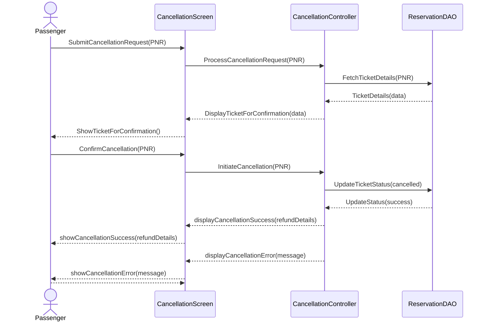
```mermaid
sequenceDiagram
  actor P1 as Passenger
  participant P2 as CancellationScreen
  participant P3 as CancellationController
  participant P4 as ReservationDAO
  P1->>P2: SubmitCancellationRequest(PNR)
  P2->>P3: ProcessCancellationRequest(PNR)
  P3->>P4: FetchTicketDetails(PNR)
  P4-->>P3: TicketDetails(data)
  P3-->>P2: DisplayTicketForConfirmation(data)
  P2-->>P1: ShowTicketForConfirmation()
  P1->>P2: ConfirmCancellation(PNR)
  P2->>P3: InitiateCancellation(PNR)
  P3->>P4: UpdateTicketStatus(cancelled)
  P4-->>P3: UpdateStatus(success)
  P3-->>P2: displayCancellationSuccess(refundDetails)
  P2-->>P1: showCancellationSuccess(refundDetails)
  P3-->>P2: displayCancellationError(message)
  P2-->>P1: showCancellationError(message)
  P1-->>P2:
```

</details>

### ⚙️ State Machine Diagrams

<details>
<summary><b>🎫 Ticket Booking lifecycle</b> — <code>diagrams/state-machine/ticket-booking.mdj</code></summary>

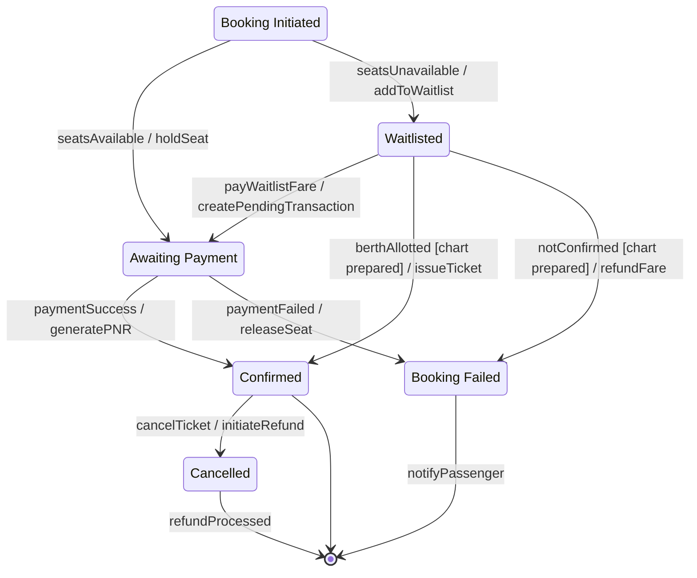
```mermaid
stateDiagram-v2
  state "Booking Initiated" as SBookingInitiated
  state "Awaiting Payment" as SAwaitingPayment
  state "Confirmed" as SConfirmed
  state "Cancelled" as SCancelled
  state "Waitlisted" as SWaitlisted
  state "Booking Failed" as SBookingFailed
  SBookingInitiated --> SAwaitingPayment: seatsAvailable / holdSeat
  SBookingInitiated --> SWaitlisted: seatsUnavailable / addToWaitlist
  SWaitlisted --> SAwaitingPayment: payWaitlistFare / createPendingTransaction
  SAwaitingPayment --> SConfirmed: paymentSuccess / generatePNR
  SAwaitingPayment --> SBookingFailed: paymentFailed / releaseSeat
  SWaitlisted --> SConfirmed: berthAllotted [chart prepared] / issueTicket
  SWaitlisted --> SBookingFailed: notConfirmed [chart prepared] / refundFare
  SConfirmed --> SCancelled: cancelTicket / initiateRefund
  SCancelled --> [*]: refundProcessed
  SBookingFailed --> [*]: notifyPassenger
  SConfirmed --> [*]
```

</details>

<details>
<summary><b>💳 Payment lifecycle</b> — <code>diagrams/state-machine/payment.mdj</code></summary>

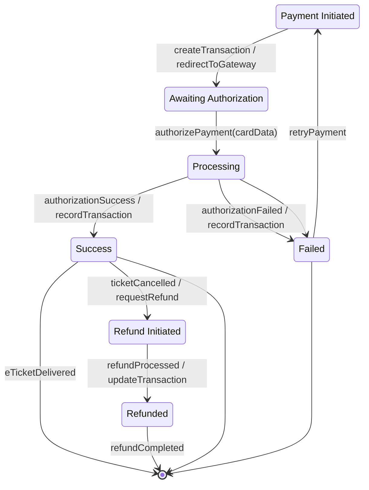
```mermaid
stateDiagram-v2
  state "Payment Initiated" as SPaymentInitiated
  state "Awaiting Authorization" as SAwaitingAuthorization
  state "Processing" as SProcessing
  state "Success" as SSuccess
  state "Failed" as SFailed
  state "Refunded" as SRefunded
  state "Refund Initiated" as SRefundInitiated
  SPaymentInitiated --> SAwaitingAuthorization: createTransaction / redirectToGateway
  SAwaitingAuthorization --> SProcessing: authorizePayment(cardData)
  SProcessing --> SSuccess: authorizationSuccess / recordTransaction
  SSuccess --> [*]: eTicketDelivered
  SProcessing --> SFailed: authorizationFailed / recordTransaction
  SFailed --> SPaymentInitiated: retryPayment
  SSuccess --> SRefundInitiated: ticketCancelled / requestRefund
  SRefundInitiated --> SRefunded: refundProcessed / updateTransaction
  SRefunded --> [*]: refundCompleted
  SProcessing --> SFailed
  SSuccess --> [*]
  SFailed --> [*]
```

</details>

### 🏗 Architecture

<details>
<summary><b>🧩 Component Diagram</b> — <code>diagrams/component/component-diagram.mdj</code></summary>

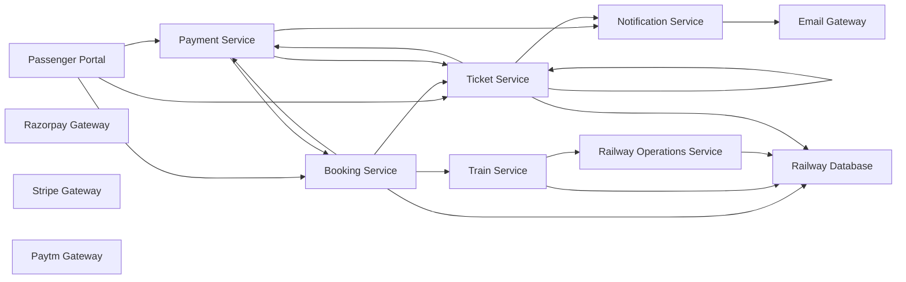
```mermaid
flowchart LR
  N1["Passenger Portal"]
  N2["Booking Service"]
  N3["Train Service"]
  N4["Railway Operations Service"]
  N5["Payment Service"]
  N6["Ticket Service"]
  N7["Railway Database"]
  N8["Notification Service"]
  N9["Email Gateway"]
  N10["Razorpay Gateway"]
  N11["Stripe Gateway"]
  N12["Paytm Gateway"]
  N1 --> N5
  N1 --> N2
  N1 --> N6
  N2 --> N6
  N2 --> N3
  N2 --> N7
  N2 --> N5
  N3 --> N4
  N3 --> N7
  N4 --> N7
  N5 --> N8
  N5 --> N6
  N5 --> N2
  N6 --> N7
  N6 --> N8
  N6 --> N6
  N6 --> N5
  N8 --> N9
```

</details>

<details>
<summary><b>📦 Package Diagram</b> — <code>diagrams/package/package-diagram.mdj</code></summary>

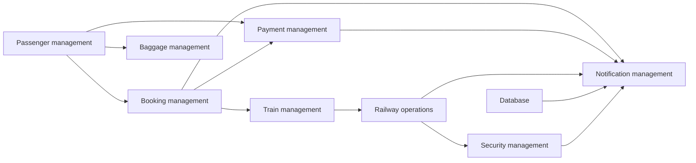
```mermaid
flowchart LR
  N1["Passenger management"]
  N2["Booking management"]
  N3["Train management"]
  N4["Baggage management"]
  N5["Payment management"]
  N6["Railway operations"]
  N7["Database"]
  N8["Notification management"]
  N9["Security management"]
  N1 --> N2
  N1 --> N5
  N1 --> N4
  N2 --> N3
  N2 --> N5
  N2 --> N8
  N3 --> N6
  N5 --> N8
  N6 --> N8
  N6 --> N9
  N7 --> N8
  N9 --> N8
```

</details>

<details>
<summary><b>🖥 Deployment Diagram</b> — <code>diagrams/deployment/deployment-diagram.mdj</code></summary>

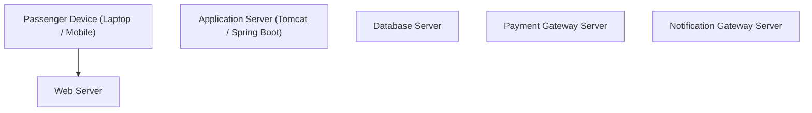
```mermaid
flowchart TB
  N1["Passenger Device (Laptop / Mobile)"]
  N2["Web Server"]
  N3["Application Server (Tomcat / Spring Boot)"]
  N4["Database Server"]
  N5["Payment Gateway Server"]
  N6["Notification Gateway Server"]
  N1 --> N2
```

</details>

## 🛠 How to Open the Models

1. Download and install [**StarUML**](https://staruml.io/) (free evaluation, Windows / macOS / Linux).
2. In StarUML: **File → Open…** and pick any `.mdj` file from the `diagrams/` folder.
3. Select the diagram in the **Model Explorer** (left panel) to render it on the canvas.
4. Tip — for the sequence diagrams, open `diagrams/sequence/…`; every file is self-contained.

## 🧭 Design Highlights

- **Waitlist handling** is modelled end-to-end: the booking state machine transitions
  `Waitlisted → Confirmed` on *berthAllotted* or `Waitlisted → Failed` with *refundFare* once the chart is prepared.
- **Refund pipeline** is a first-class concept: cancellation rules → charges → `Refund` object → gateway `processRefund()`.
- **Gateway-agnostic payments**: the component diagram isolates Razorpay / Stripe / Paytm adapters behind a common `Payment Service`.
- **Connected-route enquiries**: the enquiry flow handles *direct and connected* train combinations, not just direct trips.

## 📄 License

Released under the [MIT License](LICENSE).
